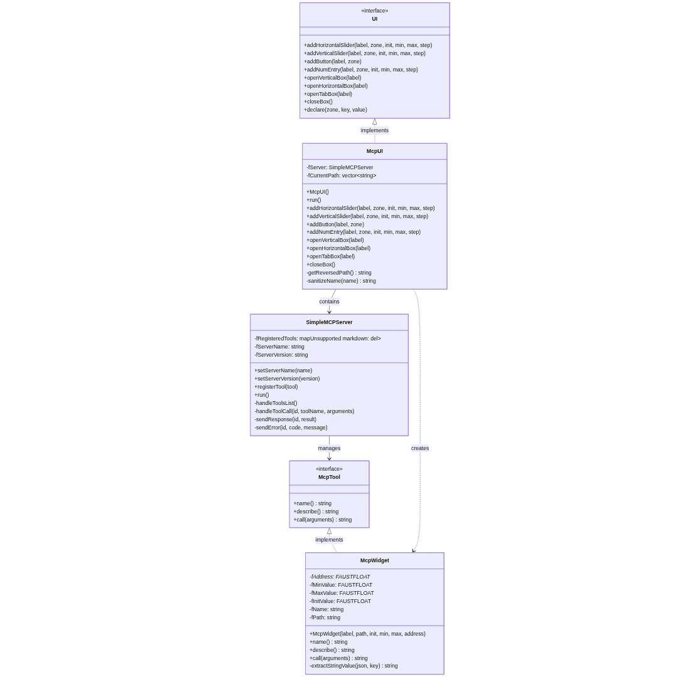

## Abstract {.unnumbered}

This paper presents a novel architecture for the FAUST (Functional Audio Stream) programming language that enables control of real-time audio processing parameters through the Model Context Protocol (MCP). Building upon FAUST's established architecture system, we introduce a header-only implementation that automatically transforms DSP widget interfaces into MCP tools, enabling AI assistants to control audio parameters through natural language interfaces. Our approach maintains FAUST's philosophy of separation between signal processing specification and control interfaces while extending it to support emerging AI-driven interaction paradigms. The architecture demonstrates how domain-specific languages for audio processing can integrate with modern AI systems without compromising performance or design principles.

**Keywords:** FAUST, Model Context Protocol, AI-driven interfaces, Real-time audio processing, Domain-specific languages

## Introduction

The FAUST (Functional Audio Stream) programming language has established itself as a mature platform for specifying real-time signal processors through its functional, domain-specific approach [1]. A key design principle of FAUST is the separation between signal processing specification and external interface concerns through its architecture system [2]. This separation has enabled FAUST programs to target diverse platforms and protocols including OSC, HTTP, MIDI, and various GUI frameworks without modification to the core DSP specification.

The emergence of AI assistants capable of tool manipulation through standardized protocols presents new opportunities for human-computer interaction in audio applications. The Model Context Protocol (MCP), introduced by Anthropic in 2024, provides a standardized JSON-RPC 2.0 framework for AI systems to interact with external tools and resources [3]. This protocol enables natural language control of software systems through structured function calls.

This paper introduces an MCP architecture for FAUST that automatically exposes DSP parameters as MCP tools, enabling AI assistants to control audio processing parameters through natural language interfaces. Our contribution extends FAUST's architecture philosophy to support AI-driven control while maintaining the language's core design principles.

## Background and Related Work

### FAUST Architecture System

The FAUST architecture system provides a clean separation between signal processing specification and platform-specific concerns [2]. A FAUST program generates a `dsp` class with a standardized interface:

```cpp
class dsp {
    virtual void buildUserInterface(UI* ui) = 0;
    virtual void compute(int len, float** in, float** out) = 0;
    virtual int getNumInputs() = 0;
    virtual int getNumOutputs() = 0;
    virtual void init(int samplingRate) = 0;
};
```

Architecture files implement the `UI` interface to bridge between FAUST's widget system and external control protocols. Existing architectures include:

- **OSC Architecture**: Real-time control via Open Sound Control protocol
- **HTTP Architecture**: Web-based interfaces using REST/WebSocket
- **Qt/GTK Architectures**: Native desktop GUI applications
- **Plugin Architectures**: VST, AU, LADSPA plugin formats

### AI-Driven User Interfaces

Recent developments in AI systems have enabled natural language control of software applications. Approaches include:

- **Voice assistants** with domain-specific integrations
- **Large language models** with function calling capabilities  
- **Multimodal AI systems** combining text, audio, and visual inputs

The Model Context Protocol represents a standardization effort for AI-tool interaction, providing a protocol-agnostic approach to exposing application functionality to AI systems.

## Model Context Protocol Integration

### MCP Protocol Overview

The Model Context Protocol defines a client-server architecture using JSON-RPC 2.0 over stdio or HTTP transport. MCP servers expose three primary component types:

- **Tools**: Functions with defined input schemas that can be invoked by AI clients
- **Resources**: Data sources that can be read by AI clients
- **Prompts**: Templates for structured AI interactions

For audio control applications, the tool mechanism provides the most relevant functionality, enabling AI systems to invoke parameter changes through structured function calls.

### Design Requirements

Our MCP architecture implementation addresses several key requirements:

**Automatic Tool Generation**: FAUST widgets must be automatically exposed as MCP tools without manual intervention.

**Hierarchical Naming**: Tool names must reflect FAUST's hierarchical UI structure to provide semantic context.

**Type Safety**: Parameter validation and range clamping must be preserved from FAUST's widget specifications.

**Minimal Dependencies**: The implementation must maintain FAUST's philosophy of minimal external dependencies.

**Integration Compatibility**: The architecture must coexist with existing FAUST architectures without conflicts.

## Implementation

### Architecture Design

Our implementation follows FAUST's established architecture pattern with two primary components:

**Generic MCP Protocol Layer** (`mcp-protocol.h`): Provides MCP server functionality independent of FAUST, including JSON-RPC message handling, tool registration, and protocol compliance.

**FAUST MCP UI Integration** (`McpUI.h`): Implements FAUST's `UI` interface, automatically converting widget additions into MCP tool registrations.

This separation enables reuse of the MCP protocol implementation in non-FAUST contexts while maintaining clean integration with FAUST's widget system.

The overall architecture consists of four main classes as illustrated in Figure 1:

{height=70%}

- **UI**: Standard FAUST interface for widget management
- **McpUI**: Bridge between FAUST widgets and MCP protocol  
- **SimpleMCPServer**: JSON-RPC 2.0 server managing tool registration and communication
- **McpWidget**: MCP tool representation of individual FAUST widgets

### Tool Generation Algorithm

The MCP architecture implements an automatic tool generation algorithm that is called during the `buildUserInterface()` traversal:

```cpp
class McpUI : public UI {
private:
    SimpleMCPServer fServer;
    std::vector<std::string> fCurrentPath;

public:
    void addHorizontalSlider(const char* label, FAUSTFLOAT* zone,
                           FAUSTFLOAT init, FAUSTFLOAT min, 
                           FAUSTFLOAT max, FAUSTFLOAT step) override {
        auto widget = std::make_unique<McpWidget>(
            label, getReversedPath(), init, min, max, zone);
        fServer.registerTool(std::move(widget));
    }
};
```

**Hierarchical Path Management**: The implementation maintains a path stack during UI traversal, with `openXXXBox()` and `closeBox()` calls managing the current widget context.

**Tool Naming Convention**: Tools are named using the pattern `{WidgetName}_{Group1}_{Group2}`, with groups ordered from most specific to most general. Names are sanitized to ensure MCP protocol compatibility.

**Server Identification**: The root group name automatically becomes the MCP server identifier, enabling multiple FAUST applications to coexist with distinct MCP identities.

### Parameter Mapping

FAUST widgets map to MCP tools with the following schema:

```json
{
    "name": "Volume_Channel_1_Mixer",
    "description": "Control Volume (Channel 1 > Mixer): range [0.0, 1.0]",
    "inputSchema": {
        "type": "object",
        "properties": {
            "value": {
                "type": "string",
                "description": "Parameter value as string"
            }
        },
        "required": ["value"]
    }
}
```

Parameter validation ensures values remain within FAUST-specified ranges:

```cpp
std::string McpWidget::call(const std::string& arguments) override {
    float value = std::stof(extractStringValue(arguments, "value"));
    value = std::clamp(value, fMinValue, fMaxValue);
    *fAddress = value;
    return "\"Parameter set to " + std::to_string(value) + "\"";
}
```

### JSON-RPC Implementation

The implementation provides a lightweight JSON-RPC 2.0 server optimized for MCP requirements:

```cpp
class SimpleMCPServer {
private:
    void handleToolCall(const std::string& id, 
                       const std::string& toolName,
                       const std::string& arguments) {
        if (fRegisteredTools.find(toolName) == fRegisteredTools.end()) {
            sendError(id, -32602, "Method not found: " + toolName);
            return;
        }
        std::string result = fRegisteredTools[toolName]->call(arguments);
        sendResponse(id, R"({"content": [{"type": "text", "text": )" + result + "}]}");
    }
};
```

This approach prioritizes simplicity and minimal dependencies over full JSON parsing libraries, using targeted string extraction for required fields.

## Evaluation and Comparison

### Comparison with OSC Architecture

The MCP and OSC architectures serve complementary roles in the FAUST ecosystem:

| Aspect | OSC Architecture | MCP Architecture |
|--------|------------------|------------------|
| **Latency** | Low (UDP/binary) | Higher (JSON-RPC/stdio) |
| **Use Case** | Real-time performance | Natural language control |
| **Client Complexity** | OSC library required | AI assistant integration |
| **Protocol Maturity** | Established (1997) | Emerging (2024) |
| **Semantic Understanding** | Address-based | AI-interpreted |

### Integration Overhead

The header-only implementation introduces minimal overhead:

- **Compilation**: Increased compile time due to header inclusion
- **Runtime**: No performance impact on DSP processing (parameter control only)
- **Memory**: Negligible additional memory footprint
- **Dependencies**: No external libraries required beyond standard C++20

### Usability Analysis

Initial testing with Claude Desktop demonstrates effective natural language control:

**Successful Interactions:**
- "Set the mixer level to 0.8" → `Level_Channel_3_Mixer` tool invocation
- "Increase reverb send" → Parameter identification and adjustment
- "Mute channel 2" → Binary parameter toggle

**Limitations:**
- Complex parameter relationships require multiple tool calls
- AI interpretation may vary between different language models
- No feedback mechanism for parameter state queries

## Future Work

### Enhanced AI Integration

Future development could explore bidirectional communication, enabling AI systems to query current parameter states and receive real-time updates. This would require extending the MCP protocol with subscription mechanisms or implementing resource-based parameter monitoring.

### Semantic Parameter Annotation

FAUST's metadata system could be leveraged to provide semantic annotations for improved AI understanding:

```faust
freq = hslider("Frequency [unit:Hz] [scale:log]", 440, 20, 20000, 1);
```

These annotations could enhance AI interpretation of parameter relationships and appropriate value ranges.

### Multi-Client Support

The current implementation supports single-client MCP connections. Multi-client support would enable concurrent control from multiple AI systems or hybrid human-AI interfaces.

### Temporal Control and Sequencing

Current LLM architectures lack intrinsic temporal awareness and real-time scheduling capabilities. While AI assistants can generate complex parameter control sequences, they cannot directly manage timing relationships between commands. Future development could explore hybrid approaches where AI systems generate temporal sequences that are executed by dedicated scheduling components:

```json
{
  "sequence": [
    {"time": 0, "tool": "play_note", "args": {"pitch": "C4"}},
    {"time": 2000, "tool": "set_filter_cutoff", "args": {"value": 0.8}},
    {"time": 5000, "tool": "stop_note", "args": {}}
  ]
}
```

This pattern would enable AI-driven composition and performance scenarios while delegating precise timing control to the host application.

### Integration with FAUST Web IDE

Web-based integration could enable browser-hosted AI assistants to control FAUST programs directly, combining the accessibility of web interfaces with AI-driven control.

## Conclusion

This work demonstrates successful integration of FAUST's architecture system with the emerging Model Context Protocol, enabling AI-driven control of real-time audio processing parameters. Our implementation maintains FAUST's core design principles while extending its applicability to modern AI-driven interaction paradigms.

The header-only architecture provides a foundation for integration into the official FAUST distribution, potentially enabling commands like `faust2mcp` for automatic MCP server generation. This approach exemplifies how domain-specific languages can adapt to emerging interaction modalities without compromising their fundamental design principles.

The MCP architecture complements existing FAUST architectures by addressing the specific requirements of AI-driven control, opening new possibilities for accessible and intelligent audio interfaces. As AI systems become increasingly capable of understanding domain-specific contexts, this work provides a foundation for more sophisticated human-AI collaboration in audio processing applications.

## References

[1] Y. Orlarey, D. Fober, and S. Letz, "FAUST: an Efficient Functional Approach to DSP Programming," in *New Computational Paradigms for Computer Music*, Editions DELATOUR FRANCE, 2009, pp. 65–96.

[2] D. Fober, Y. Orlarey, and S. Letz, "FAUST Architectures Design and OSC Support," in *Proceedings of the 14th International Conference on Digital Audio Effects (DAFx-11)*, Paris, France, September 19-23, 2011.

[3] Anthropic, "Model Context Protocol Specification," 2024. [Online]. Available: https://spec.modelcontextprotocol.io/

[4] M. Wright and A. Freed, "Open Sound Control: A New Protocol for Communicating with Sound Synthesizers," in *Proceedings of the International Computer Music Conference*, 1997.

[5] Y. Orlarey, D. Fober, and S. Letz, "An algebra for block diagram languages," in *Proceedings of International Computer Music Conference*, ICMA, Ed., 2002, pp. 542–547.